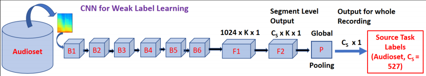

## Sound classification based on transfer of knowledge using weakly labeled audio 

###Extraction of useful infromation from sounds
For the purposes of this thesis, mel spectrogram of the sounds was used as a source of descriptive information about the sounds. The spectrograms are extracted using [librosa](https://github.com/librosa/librosa) melspectrogram function. The details can be found in ***feat_extractor.py*** 

###Transfer learning
Extracted spectrograms are passed to a deep model pretrained on [AudioSet](https://research.google.com/audioset/) to produce embeddings. Image below demonstrates the network architecture of deep feature extractor.  

B1-B5 are convolutional blocks containing 2 conv layers with batch norm and Relu followed by Max Pooling. Similarly, B6 and F1 are single convolutional layers with Batch Norm, with the distinction of final max pooling layer in case of B6.  Following layers are omitted for the purpose of training the classifier. 

###Classifier layers

###Training results

###Testing results

##References
#### https://arxiv.org/pdf/1711.01369.pdf
